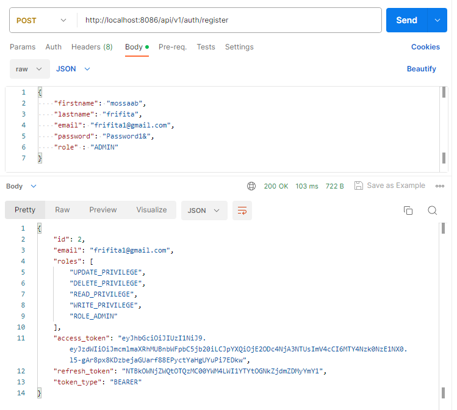

# JWT Implementation with Spring Boot 3 and Spring Security 6

This repository showcases a project that demonstrates the implementation of JSON Web Tokens (JWT) with Spring Boot 3 and Spring Security 6. The project includes the following functionalities:

- User Registration and Login with JWT Authentication
- Refresh Token stored in db
- Role-Based Authorization with authorities
- Customized Access Denied Handling
- OpenAPI Documentation Integration (Swagger)

# Technologies

- Spring Boot 3.1
- Spring Security
- Spring Data JPA
- Spring Boot custom Validation
- JSON Web Tokens(JWT)
- BCrypt
- Maven
- OpenAPI(SpringDoc Impl)
- Lombok

# Getting Started
To get started with this project, you will need to have the following installed on your local machine:
- JDK 17+
- Maven 3+
## Configure Spring Datasource, JPA, App properties
1. Clone the repository
2. Open src/main/resources/application.yml
```
spring:
  datasource:
    driver-class-name: org.postgresql.Driver
    url: jdbc:postgresql://localhost:5432/db_security
    username: postgres
    password: ${POSTGRES_PASSWORD}
  jpa:
    hibernate:
      ddl-auto: create
    show-sql: true
    properties:
      hibernate:
        format_sql: true
    database: postgresql
    database-platform: org.hibernate.dialect.PostgreSQLDialect
server:
  port: 8086
application:
  security:
    jwt:
      secret-key: 586B633834416E396D7436753879382F423F4428482B4C6250655367566B5970
      expiration: 86400000 # a day
      refresh-token:
        expiration: 604800000 # 7 days
```
## Build and run the Project
- Build the project: `mvn clean install`
- Run the project: `mvn spring-boot:run`

The application will be available at http://localhost:8086.

# Test project
## User registration endpoint

`POST http://localhost:8086/api/v1/auth/register`



For detailed documentation and testing of the APIs, access the Swagger UI by visiting:
```
http://localhost:8086/swagger-ui.html
```
